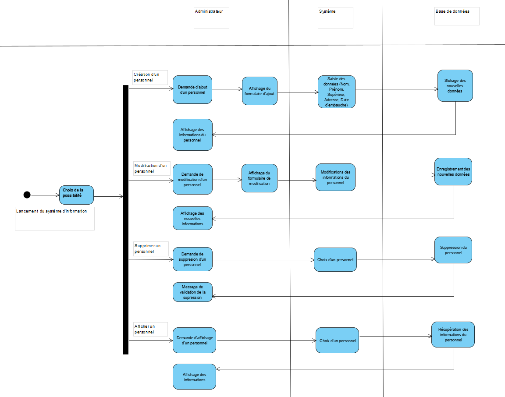
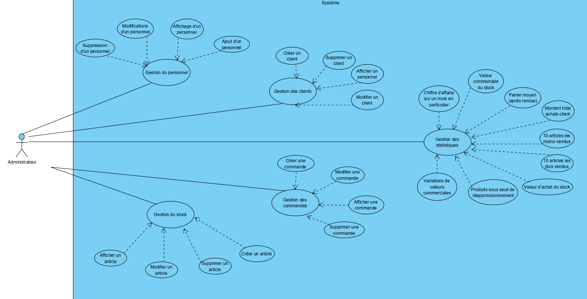
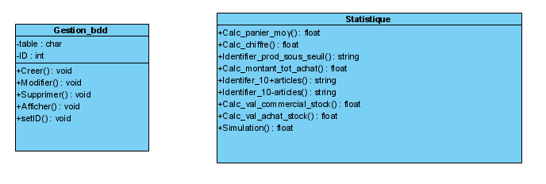
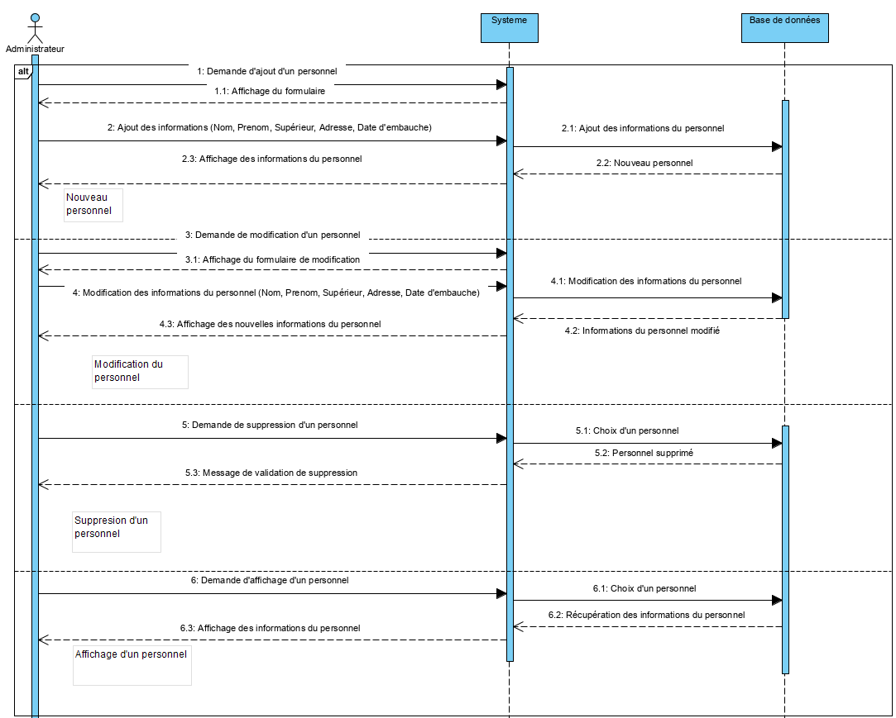
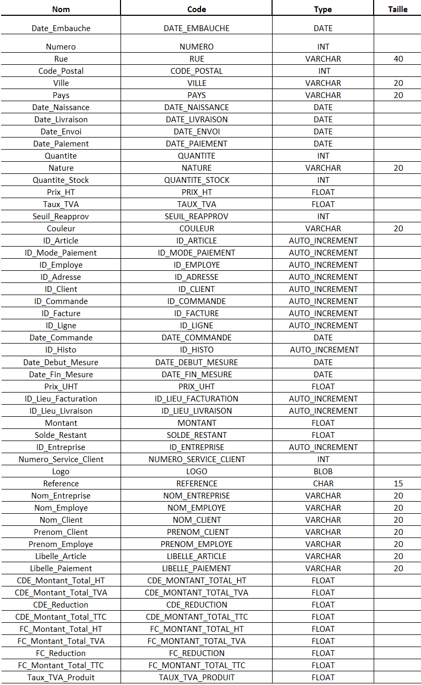
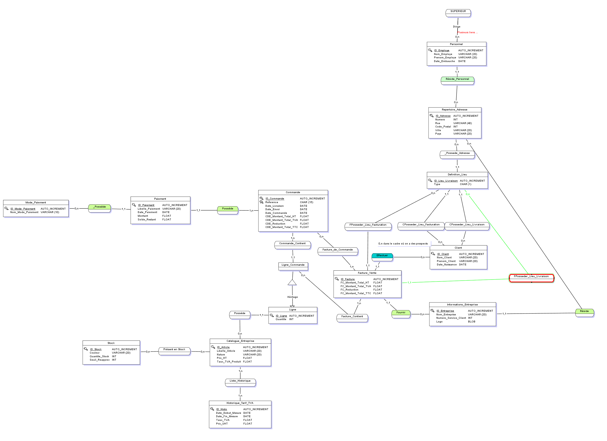
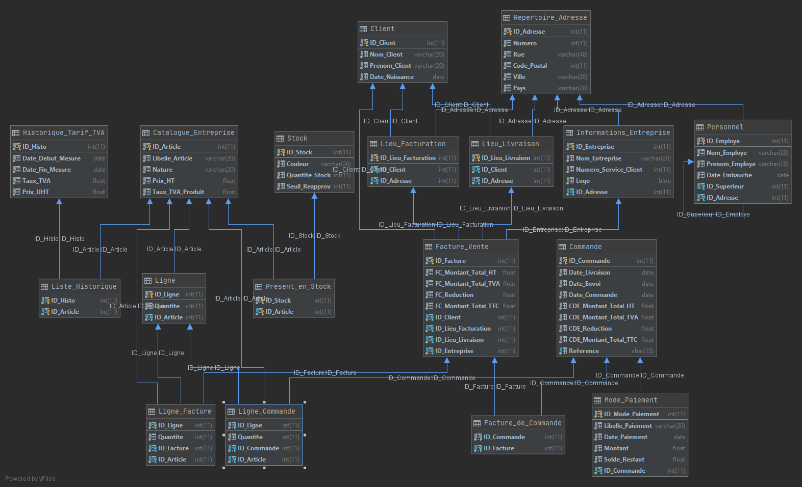

# Modélisation

## Contexte

Nous devons modéliser l'application que nous créerons ainsi que la base de donnée liée.

## Modélisation de l'application

### Diagramme d'activité

[***Fichier source VPP***](./Diagrammes/Activity_Diagram.vpp)

### Diagramme de cas d'utilisation

[***Fichier source VPP***](./Diagrammes/Use_Case_Diagram.vpp)

### Diagramme de classe

[***Fichier source VPP***](./Diagrammes/Class_Diagram.vpp)

### Diagramme de sequence

[***Fichier source VPP***](./Diagrammes/Sequence_Diagram.vpp)

## Modélisation de la BDD

### Dictionnaire de données

### MCD

[***Fichier source MCD***](./Merise/MCD/MCD)

### MLD

[***Fichier source UML***](./Merise/MLD/MLD.uml)

### Script SQL

[***Script SQL.sql***](./Merise/Script_SQL/Script_SQL.sql)
